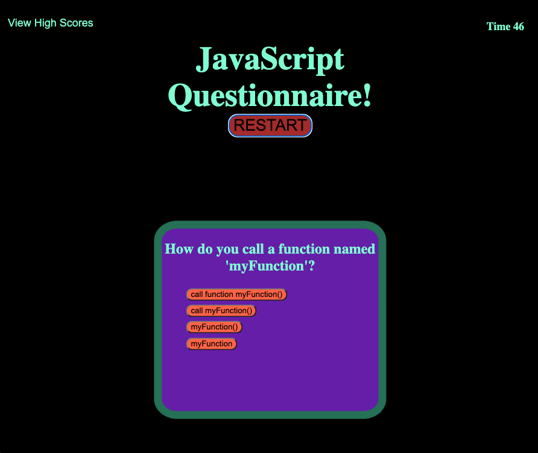

# Javascript Questionnaire
Here is this Repo I create a Javascript Questionnaire. 
I built this using HTML, CSS, and Javascript. The questions for this quiz came from [W3 schools](https://www.w3schools.com/quiztest/quiztest.asp?qtest=JS). I used a few questions from their quiz to build Javascripts objects that contain the question, 4 answer possibilties, and an asnwer. I place the objects into a array and then use the 
[Math Random](https://developer.mozilla.org/en-US/docs/Web/JavaScript/Reference/Global_Objects/Math/random)
method to make the order of the answers different everytime the quiz is started.  

You can take the quiz yourself [here](https://olegreg762.github.io/Javascript_questionnaire/
)

